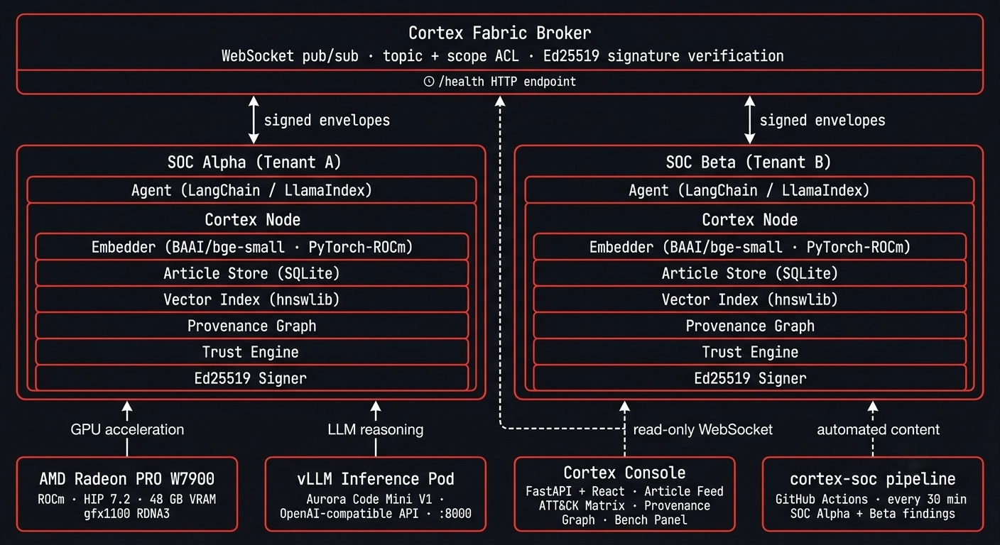

# Perciqa Cortex

> **The memory fabric for the agent economy.**

Cortex is a decentralized network of sovereign nodes that lets AI agents share **memory articles** across organizational trust boundaries, without exposing raw data, weights, or trusting a central vendor. Every article carries cryptographic provenance, scoped permissions, and a derived trust score.

[](https://github.com/perciqa/cortex/actions/workflows/ci.yml)
[](https://www.python.org/)
[](https://rocm.docs.amd.com/)
[](https://github.com/perciqa/cortex)

**[▶ Watch the demo](https://youtu.be/LEs7aeuJ6b8)** &nbsp;|&nbsp; **[Live console](https://cortex.perciqa.com)**

[](https://youtu.be/LEs7aeuJ6b8)

---

## The Problem

Today's AI memory is **single-tenant by default**. There is no production-grade protocol where Agent A (say, a hospital) can ask *"what did Agent B (say, a research lab) discover about condition Z?"* and get back a signed, scoped, provenance-tagged memory article, without either side exposing raw data or rebuilding trust infrastructure from scratch.

| Existing product | What it lacks |
|---|---|
| Pinecone / Qdrant / Weaviate | Single-tenant. No agent-native semantics. No provenance. No cross-org. |
| Letta (MemGPT) | One agent, one tenant. Not a fabric. |
| LangChain Memory / Mem0 | Ephemeral. Single-session. Not shareable. |
| Federated knowledge graphs (academic) | Not agent-native. Not production-grade. No product. |

Cortex is the missing layer.

---

## How It Works

There are three runtime loops.

**Publish.** An agent produces a finding. The local Cortex node signs it with Ed25519 keys, computes its embedding on a local GPU, and broadcasts it to subscribed peers within the article's scope. Peers verify the signature and index it locally.

**Query.** An agent asks *"what's known about X?"* The node embeds the query, runs semantic retrieval over its local fabric partition, and returns ranked articles with full provenance. Results are ranked by a blend of cosine similarity and trust score, so trust shapes what agents actually see rather than just appearing in the UI.

**Derive.** An agent composes a new article from existing ones. The provenance graph grows and trust propagates: articles that cite high-trust sources get a lift, and ones that cite low-trust sources take a penalty.

---

## Architecture



```
┌─────────────────────────────────────────────────────────────┐
│                   Cortex Fabric Broker                       │
│          (federated pub/sub, topic + scope ACL)              │
└──────────────────┬──────────────────────┬───────────────────┘
                   │                      │
   ┌───────────────▼───────────┐  ┌───────▼───────────────────┐
   │  Tenant A                  │  │  Tenant B                  │
   │                            │  │                            │
   │  ┌────────┐  ┌──────────┐  │  │  ┌────────┐  ┌──────────┐  │
   │  │ Agent  │→ │  Node A  │  │  │  │ Agent  │→ │  Node B  │  │
   │  └────────┘  │          │  │  │  └────────┘  │          │  │
   │              │ Embedder │  │  │              │ Embedder │  │
   │              │ ArtStore │  │  │              │ ArtStore │  │
   │              │ VecIndex │  │  │              │ VecIndex │  │
   │              │Provenance│  │  │              │Provenance│  │
   │              │  Signer  │  │  │              │  Signer  │  │
   │              │TrustEng. │  │  │              │TrustEng. │  │
   │              └──────────┘  │  │              └──────────┘  │
   └────────────────────────────┘  └────────────────────────────┘
```

| Module | Purpose |
|---|---|
| `cortex-core` | Data model, crypto, and serialization. No external dependencies. |
| `cortex-node` | Local tenant node: embedder, store, signer, and query engine |
| `cortex-broker` | Federated pub/sub routing with topic and scope ACL |
| `cortex-sdk` | Agent-facing convenience layer with LangChain and LlamaIndex adapters |
| `cortex-console` | Real-time web UI: article feed, ATT&CK matrix, provenance graph, bench panel, ROCm/LLM info |
| `cortex-bench` | GPU vs CPU benchmark harness with Prometheus metrics |

---

## Data Model

The atomic unit is a **MemoryArticle**:

```python
@dataclass(frozen=True)
class MemoryArticle:
    id: ArticleId          # sha256(canonical(content + provenance))
    type: ArticleType      # finding | insight | precedent | procedure | warning
    content: str           # natural-language summary
    payload: dict          # structured typed payload

    embedding: list[float] | None   # computed locally on GPU at publish time
    provenance: Provenance
    scope: Scope           # private | partner:<org_did> | public

    agent_signature: bytes          # Ed25519, signs all canonical fields
    org_signature: bytes | None     # Ed25519 co-sign by org key

    cites: list[ArticleId]          # articles this one was derived from
    trust_score: float | None       # [0, 1], recomputable, not signed


@dataclass(frozen=True)
class Provenance:
    producer_agent: AgentDID        # did:percq:agent:<uuid>
    producer_org: OrgDID            # did:percq:org:<slug>
    source_data_hash: str | None    # sha256 commitment, never the raw data
    run_id: str
    timestamp: datetime
```

### Lifecycle

```
Drafted -> Signed -> Indexed -> Published -> Cited -> Archived
```

Articles with `private` scope never leave the local node. `partner:<org_did>` articles go only to that named org. `public` articles reach all subscribed peers.

---

## Getting Started

### Prerequisites

- Python 3.11+
- AMD Radeon GPU with ROCm 6.1+ (recommended) _or_ any CUDA-capable GPU _or_ CPU-only (fallback)

### Installation

```bash
# 1. Clone the repository
git clone https://github.com/perciqa/cortex.git
cd cortex

# 2. Create and activate a virtual environment
python3 -m venv .venv
source .venv/bin/activate  # Windows: .venv\Scripts\activate

# 3. Install the package with dependencies
pip install -e ".[dev,cpu]"       # CPU-only fallback
# OR for GPU support:
pip install -e ".[dev,gpu]"       # Requires ROCm/CUDA PyTorch

# 4. Verify installation
pytest -q tests/
```

### Running the Fabric

```bash
# Start the broker (WebSocket + health endpoint on 7432)
python -m cortex.broker --config deploy/config/broker.yaml

# Start a node per tenant (separate terminals; see deploy/config/ for templates)
python -m cortex.cli start --config deploy/config/alpha.yaml
python -m cortex.cli start --config deploy/config/beta.yaml

# Start the Console UI (separate terminal)
python -m cortex.console --broker ws://localhost:7432 --port 8080
# Open http://localhost:8080 in your browser
```

### Environment Configuration

`deploy/config/` contains YAML templates for the broker, nodes, and registry:

| File | Purpose |
|---|---|
| `broker.yaml` | Broker WebSocket port, registry path, replay window |
| `node-alpha.yaml` | Tenant node config (org DID, keys, embedder, vector index) |
| `node-beta.yaml` | Second tenant node config |
| `org_registry.json` | Org public keys for signature verification |

Key environment overrides:

| Variable | Purpose |
|---|---|
| `CORTEX_BROKER_URL` | Override broker WebSocket URL |
| `CORTEX_EMBED_BACKEND` | Force `gpu` or `cpu` embedding backend |
| `CORTEX_LOG_LEVEL` | Set logging verbosity (`DEBUG`, `INFO`, `WARN`) |
| `VLLM_URL` | OpenAI-compatible API endpoint for live LLM reasoning |
| `VLLM_API_KEY` | API key for the LLM endpoint (if required) |
| `VLLM_MODEL` | Model name override (default: `perciqa/aurora-code-mini-v1`) |

When `VLLM_URL` or `VLLM_API_KEY` is set, agent reasoning routes through the live LLM instead of using scripted responses.

### Running with Live LLM Reasoning

```bash
# Using a locally-served OpenAI-compatible endpoint (e.g. vLLM on localhost:8000):
VLLM_URL=http://localhost:8000/v1 python -m cortex.cli start --config deploy/config/alpha.yaml

# Or with a hosted API (Groq, Together AI, etc.):
VLLM_URL=https://api.groq.com/openai/v1 \
  VLLM_API_KEY=gsk_... \
  VLLM_MODEL=perciqa/aurora-code-mini-v1 \
  python -m cortex.cli start --config deploy/config/alpha.yaml
```

### Running Tests

```bash
pytest -q tests/                 # All tests (~213)
pytest tests/unit/               # Unit tests only
pytest tests/integration/        # Integration tests (broker + two-node)
pytest tests/e2e/                # End-to-end demo scenario tests
```

### Project Structure

```
cortex/
├── core/          # Data model, crypto, canonical JSON, envelope protocol
├── node/          # Local tenant node (embedder, store, vector index, trust engine)
├── broker/        # Federated pub/sub WebSocket server with ACL
├── sdk/           # Agent-facing client + LangChain/LlamaIndex adapters
├── bench/         # GPU vs CPU benchmark harness
└── console/       # FastAPI backend + React SPA web UI
```

## Hackathon Submission

This repo is submitted to the **AMD AI DevMaster Hackathon 2026**.

### Live Demo

- **Video:** https://youtu.be/LEs7aeuJ6b8
- **Console:** https://cortex.perciqa.com *(live, no setup required)*
- **Hackathon deck:** [Perciqa Cortex Hackathon Deck](Perciqa_Cortex_Hackathon_Deck.pptx)

### Hackathon Documents

- [Project Specification](hackathon/project-specification.md) — scenarios, architecture, core capabilities, model intro, local deployment plan, ROCm optimization
- [Inference Optimization on AMD](hackathon/inference-optimization.md) — live Radeon-vs-CPU bench numbers and methodology
- [Application Scenarios](hackathon/application-scenarios.md) — SOC Alpha/Beta scenario banks and cross-org fabric operations

### AMD / ROCm Integration

- **Embedder:** BAAI/bge-small-en-v1.5 on PyTorch-ROCm (AMD Radeon PRO W7900, RDNA3, 48 GB VRAM)
- **Measured throughput:** 6.68 ms/embed · >1,000 embeds/sec in batch · 4× faster than CPU
- **Inference:** Aurora Code Mini V1 (fine-tuned on AMD infrastructure) served by vLLM on ROCm
- **GPU monitoring:** Live `rocm-smi` metrics via bench sidecar, Prometheus exporter on `:9464`
- **Fallback:** Embedder auto-halves batch size on OOM and falls back to CPU; reasoning falls back to scripted mode

### Content Pipeline

A GitHub Actions workflow ([cortex-soc](https://github.com/WeSavetheKids/cortex-soc)) publishes fresh MITRE ATT&CK threat-intel findings from two SOC agents (Alpha: APT/espionage, Beta: ransomware/cybercrime) into the live fabric every 30 minutes — so the hosted console always has real, recent content.

### Test Suite

~213 tests across unit, integration, and end-to-end. Run with:

```bash
pytest tests/
```

## License

MIT

---

<sub>By [Perciqa](https://github.com/perciqa)</sub>
